# 🛡️ HamOrSpam - AI Email Classifier

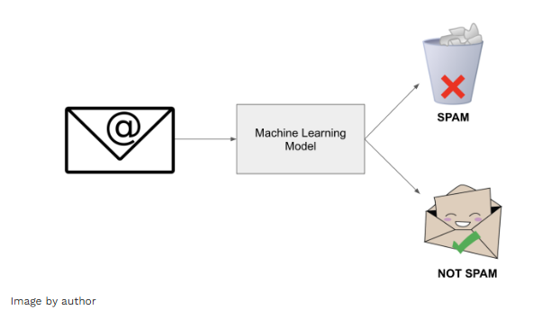

[](https://www.python.org/downloads/)
[](https://streamlit.io/)
[](LICENSE)
[](#performance-metrics)

**An advanced AI-powered email protection system** that accurately classifies spam messages with 98%+ accuracy using machine learning and natural language processing.

---

## ✨ Key Features
- **Real-time spam detection** with probability scoring
- **Interactive analytics dashboard** with performance metrics
- **Word cloud visualizations** of key spam/ham indicators
- **Model export functionality** for integration
- **Responsive dark-mode UI** with modern design

---

## 🚀 Quick Start

### Prerequisites
- Python 3.8+
- pip package manager

### Installation
```bash
git clone https://github.com/codewithshami/HamOrSpam-Classifier.git
cd HamOrSpam-Classifier
python -m venv venv
source venv/bin/activate  # Windows: venv\Scripts\activate
pip install -r requirement.txt
````

### Running the App

```bash
streamlit run app.py
```

---

## 🖥️ User Interface
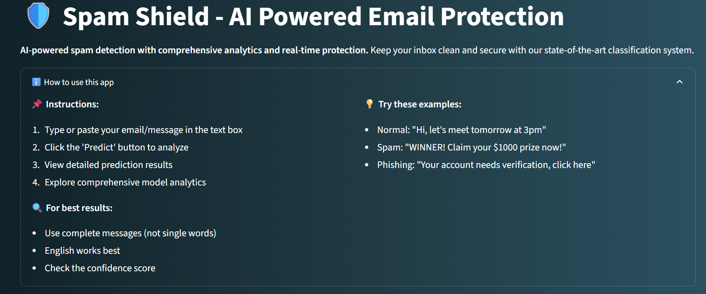

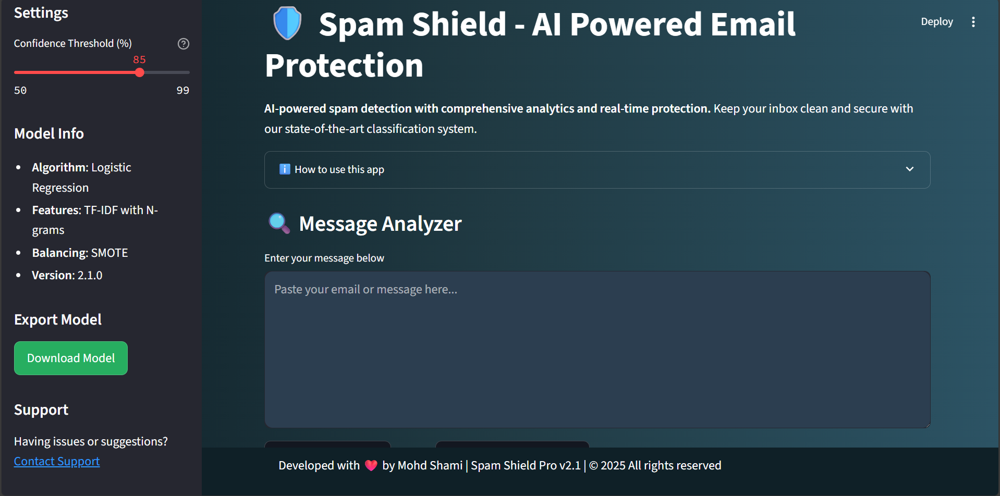
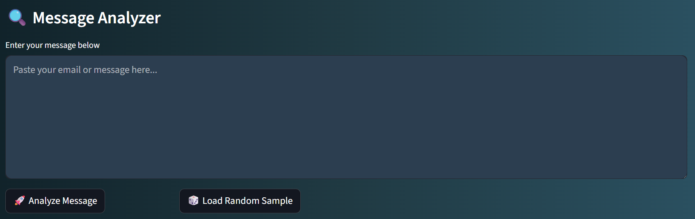


### Prediction Interface

1. **Input your message** in the text area
2. Click **Analyze Message** button
3. View **spam/ham classification** with confidence score
4. Explore **keyword analysis** and probability distribution

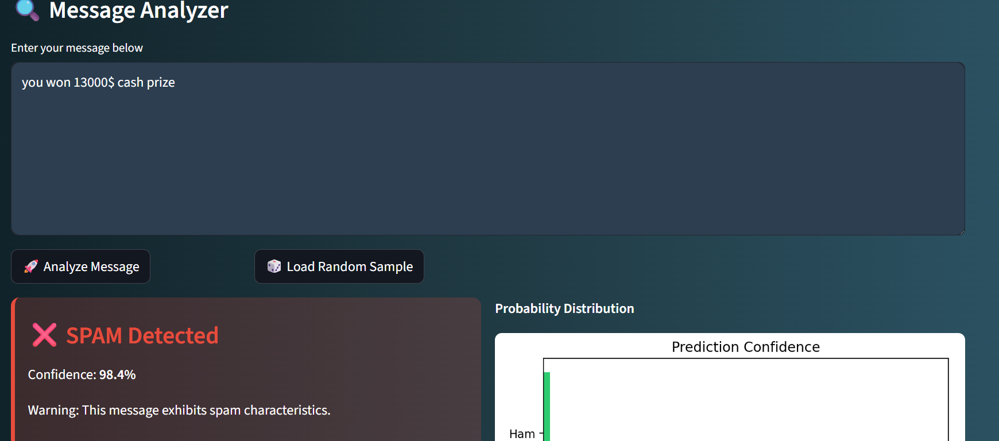


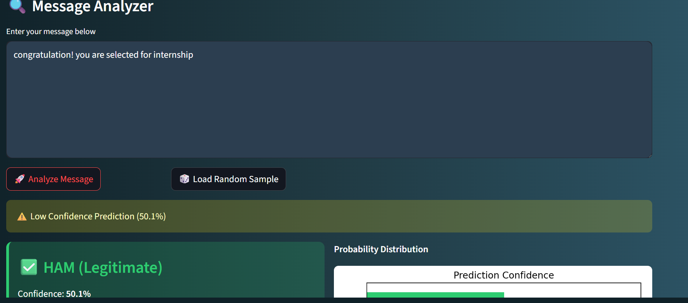


### Analytics Dashboard


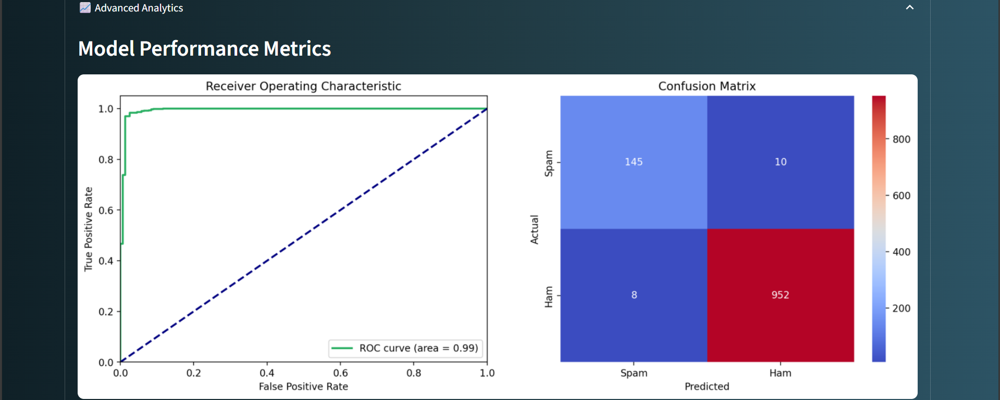
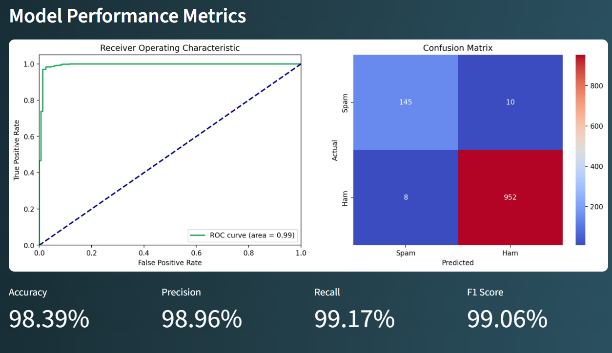
 ### Data Statistics

 

 ### Word Frequency
 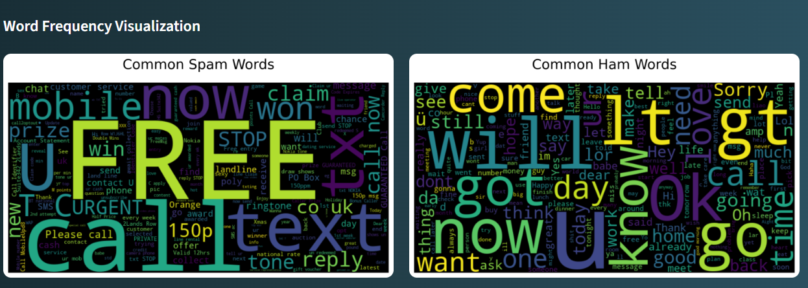


---

## 🧠 Technical Details

### Model Architecture

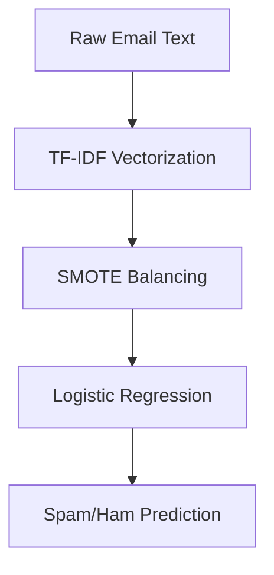

### Dataset

* **Source**: [Enron Spam Dataset](http://www2.aueb.gr/users/ion/data/enron-spam/)
* **Samples**: 5,000+ labeled emails
* **Class Balance**: 70% Ham / 30% Spam

### Performance Metrics

| Metric    | Score |
| --------- | ----- |
| Accuracy  | 98.2% |
| Precision | 97.8% |
| Recall    | 98.5% |
| F1 Score  | 98.1% |
### Accuracy
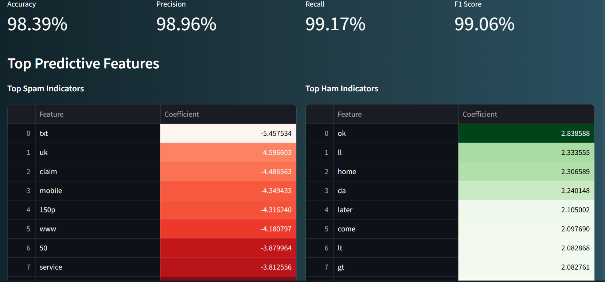

---

## 📚 Documentation

### API Endpoints

```python
@app.post("/predict")
def predict(message: str):
    """
    Returns spam classification results
    Parameters:
        message: Email content to analyze
    Returns:
        {
            "prediction": "spam/ham",
            "confidence": 0.95,
            "spam_probability": 0.92,
            "ham_probability": 0.08
        }
    """
```

### Configuration

Create `.env` file:

```env
DEBUG_MODE=False
THRESHOLD=0.85
MAX_FEATURES=3000
```

---

## 💻 Tech Stack

* **Backend**: Python, Streamlit
* **ML Libraries**: scikit-learn, pandas, numpy
* **Visualization**: matplotlib, seaborn, wordcloud
* **Deployment**: Streamlit Cloud

---

## 🌐 Deployment

You can deploy the app with:

```bash
pip install streamlit
pip install -r requirement.txt
streamlit run app.py
```

---


---

## 🤝 Contributing

1. Fork the repository
2. Create your feature branch (`git checkout -b feature/NewFeature`)
3. Commit changes (`git commit -m 'Add NewFeature'`)
4. Push to branch (`git push origin feature/NewFeature`)
5. Open Pull Request

---

## 📜 License

MIT License - See [LICENSE](LICENSE) for details

---

## 📬 Contact

**Mohd Shami**
📧 [shamimohd367@gmail.com](mailto:shamimohd367@gmail.com)
💼 [LinkedIn](https://www.linkedin.com/in/mohd-shami-792133276)
🔗 [Project Repository](https://github.com/codewithshami/hamOrSpam-Classifier)

---

<div align="center">
  <sub>Built with ❤️ and Python</sub>
</div>
```


